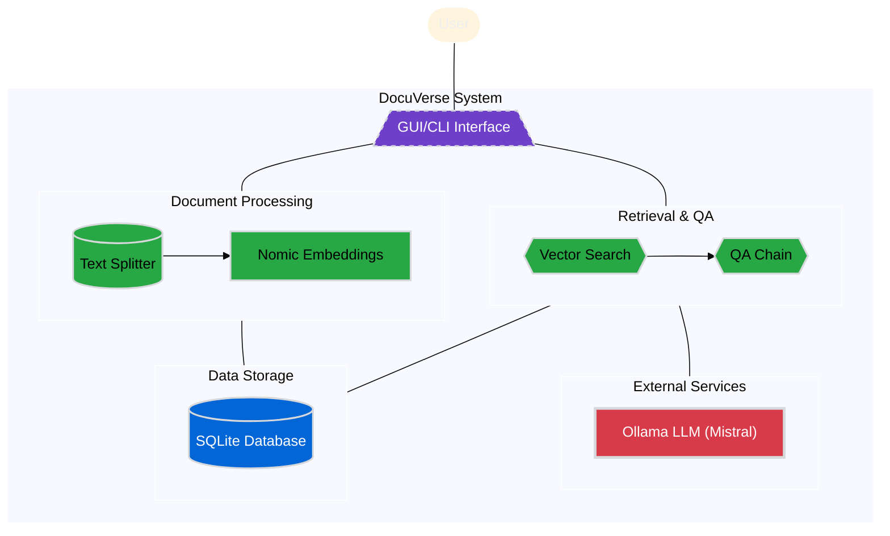
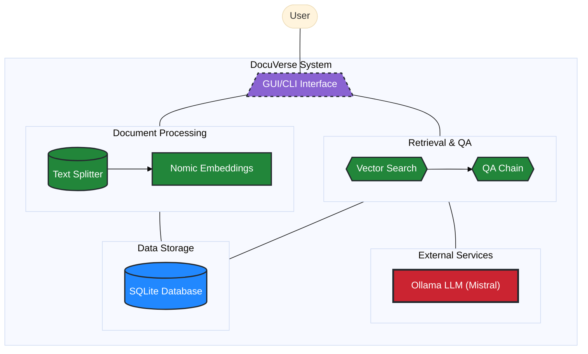

# DocuVerse

[](https://github.com/ai-mindset/docuverse/actions/workflows/build-linux.yml) [](https://github.com/ai-mindset/docuverse/actions/workflows/build-windows.yml) [](https://github.com/ai-mindset/docuverse/actions/workflows/py-lint-format.yml) [](https://github.com/ai-mindset/docuverse/actions/workflows/py-type-check.yml)

A self-hosted, privacy-preserving Question & Answer application for easy information retrieval from your personal document collection. DocuVerse (a blend of "Document" and "Converse") helps you interact with your documents through natural language queries, providing contextually relevant answers powered by language models—all while keeping your data completely private on your local machine.

## System Architecture

### Component Structure


### Data flow 


## Features

- **Interactive Q&A**: Ask questions about your documents in natural language
- **Document Management**: Add and index text and markdown documents
- **Modern GUI**: Clean, responsive interface with dark and light mode support
- **Conversation History**: Track the full context of your document exploration
- **Customisable Retrieval**: Adjust parameters to optimise search relevance

## Installation

### Prerequisites
- Python 3.13 or higher (for development)
- Install [Ollama](https://ollama.com/download) installed and running locally (for language model support)
- Download the [mistral 7b](https://ollama.com/library/mistral) LLM with `ollama pull mistral` if you have a mainstream computer. Opt for [mistral-small 24b](https://ollama.com/library/mistral-small:24b) if you have a higher-end setup (run `ollama run mistral-small:24b`)

### Method 1: Using AppImage (Linux)
1. Download the latest AppImage from the [Releases](https://github.com/ai-mindset/docuverse/releases) page
2. Make it executable: `chmod +x dv-*-x86_64.AppImage`
3. Run the application: `./dv-*-x86_64.AppImage`

### Method 2: From Source
```bash
# Clone the repository
git clone https://github.com/ai-mindset/docuverse.git
cd docuverse

# Install using uv (recommended)
curl -LsSf https://astral.sh/uv/install.sh | sh
uv venv
source .venv/bin/activate
uv pip install -e .

# Or install using pip
pip install -e .

# Run the application
python -m dv.main
```

## Usage

### Adding Documents
1. Start the application
2. Click "Add Document" and select your text (.txt) or markdown (.md) files
3. Click "Reindex Documents" to process and prepare them for queries

### Querying Your Documents
1. Type your question in the input box
2. Press Enter or click "Send"
3. View the AI's response, which will include information from relevant documents

### Command Line Options
DocuVerse can be run with various options:

```bash
python -m dv.main [OPTIONS]

Options:
  --cli                  Use command-line interface instead of GUI
  --model MODEL          Specify which Ollama model to use
  --temperature TEMP     Set the temperature (0-1) for LLM responses
  --results NUM          Number of documents to retrieve for context
  --reindex              Force reindexing of all documents
  --light-mode           Use light mode for GUI
```

## Configuration

DocuVerse can be customised by modifying settings in the config.py file:

- **LLM_MODEL**: The default Ollama model (default: "mistral-small:24b-instruct-2501-q4_K_M")
- **CHUNK_SIZE**: Size of document chunks for processing (default: 1000)
- **DOCS_DIR**: Directory for document storage
- **GUI_FONT**: Font settings for the UI

## Development

### Setting Up the Development Environment
```bash
# Install development dependencies
uv pip install -e ".[dev]"

# Run code quality checks
ruff check .
ruff format .
pyright .
```

## License

[MIT License](./LICENSE)

## Acknowledgements

DocuVerse is built using several open-source technologies:
- [LangChain](https://www.langchain.com/) for document processing and retrieval
- [Ollama](https://ollama.ai/) for local language model inference
- [CustomTkinter](https://github.com/TomSchimansky/CustomTkinter) for the modern UI
